# Movies App

A feature-rich Flutter application that showcases popular movies using The Movie Database (TMDB) API. This app demonstrates clean architecture principles, modern state management, offline-first approach, and professional UI/UX design.

## Features

- Browse popular movies with pagination
- View detailed movie information
- Offline-first architecture with caching
- Multiple theme support (Light, Dark, Custom Pastel)
- Network connectivity detection
- Smooth animations and transitions
- Image caching for optimal performance
- Clean Architecture with proper separation of concerns

## Screenshots

### Splash Screen

<p align="center">
  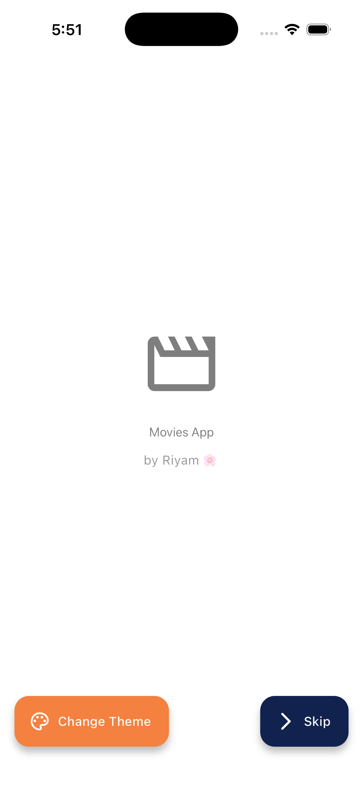
  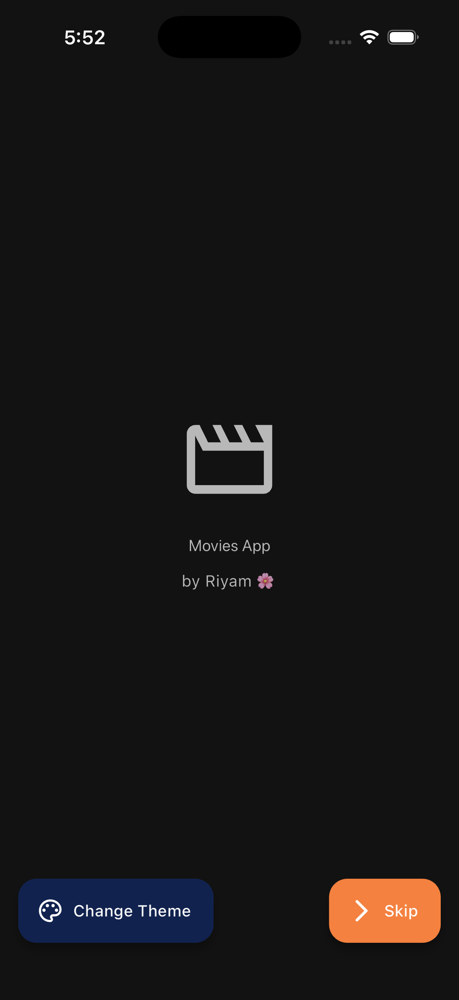
  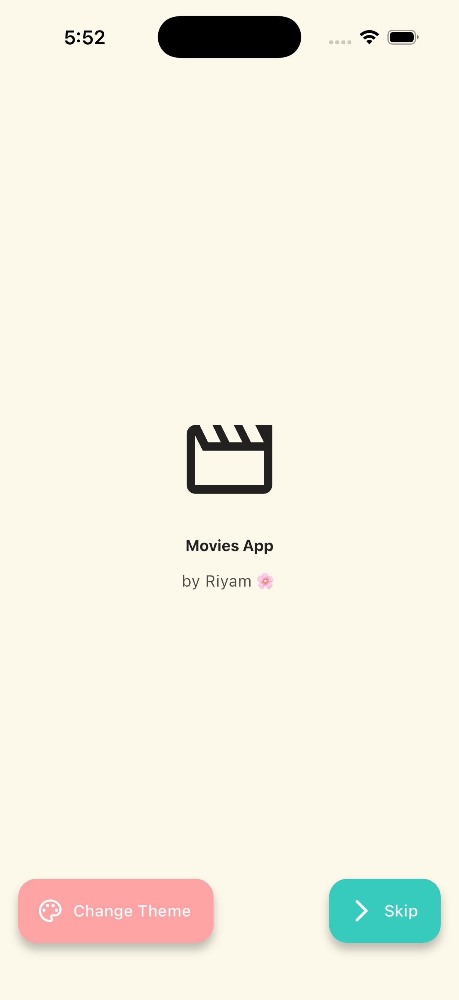
</p>

### Movies List

<p align="center">
  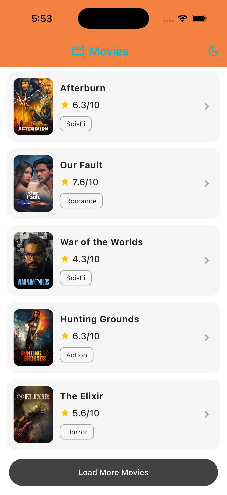
  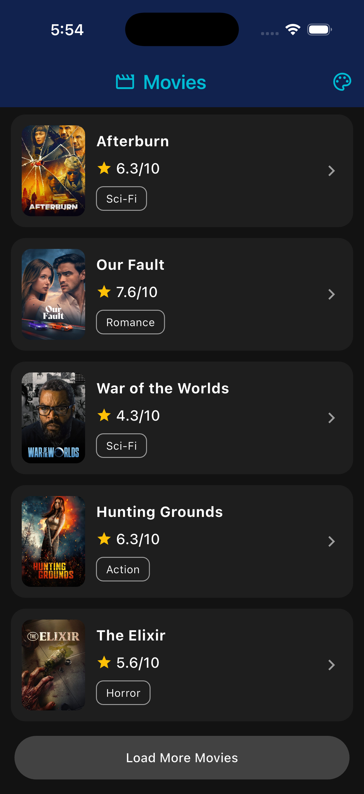
  
</p>

### Movie Details

<p align="center">
  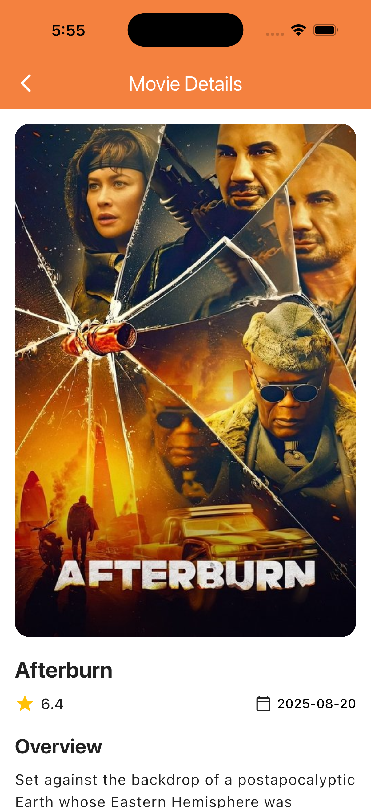
  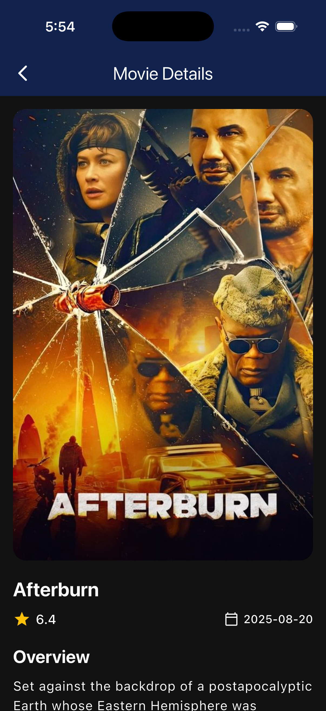
  
</p>

## Demo

### App Demo


### With WiFi Connection


### Without WiFi Connection (Offline Mode)


### Movies List - Offline Mode

<p align="center">
  
</p>

The screenshot above shows the movies list page when WiFi is turned off, demonstrating the offline-first caching functionality where previously loaded movies are still accessible.

## Architecture

The app follows **Clean Architecture** principles with three main layers:

```
lib/
├── core/                          # Core utilities and configurations
│   ├── constants/                 # API constants
│   ├── di/                        # Dependency injection (GetIt)
│   ├── error/                     # Error handling & failures
│   ├── network/                   # Dio client configuration
│   ├── routing/                   # GoRouter configuration
│   ├── storage/                   # Secure storage
│   ├── theme/                     # Theme management
│   └── utils/                     # Network helper utilities
│
├── features/movies/               # Movies feature module
│   ├── data/
│   │   ├── datasources/           # API service & cache managers
│   │   │   ├── movie_api_service.dart
│   │   │   ├── movie_cache_manager.dart (movies list)
│   │   │   └── movie_details_cache_manager.dart (movie details)
│   │   ├── models/                # Data models (Hive + JSON)
│   │   └── repositories/          # Repository implementation
│   ├── domain/
│   │   ├── entities/              # Business entities
│   │   └── repositories/          # Repository interface
│   └── presentation/
│       ├── cubit/                 # State management (BLoC)
│       └── pages/                 # UI pages
│
└── main.dart                      # App entry point
```

### Data Flow

```
Presentation Layer (UI)
    ↓
Cubit (State Management)
    ↓
Repository Interface
    ↓
Repository Implementation
    ├─→ Local Cache (Hive)
    │   ├─→ MovieCacheManager (movies list)
    │   └─→ MovieDetailsCacheManager (movie details)
    └─→ Remote API (Retrofit + Dio)
```

**Cache-First Strategy:**
- Repository checks cache before making API calls
- If data exists in cache, return immediately
- If cache miss, fetch from API and cache the result
- Provides offline support and improves performance

## State Management

The app uses **BLoC pattern with Cubit** for state management:

- **MovieCubit**: Manages movies list, pagination, and caching
- **MovieDetailsCubit**: Handles individual movie details
- **ThemeProvider**: Manages theme switching using Provider

### State Classes

- `MovieInitial` - Initial state
- `MovieLoading` - Loading indicator
- `MovieLoaded` - Data successfully loaded
- `MovieError` - Error state with message

## Key Features Implementation

### 1. Splash Screen

- Animated fade-in effect
- Auto-navigation after 20 seconds
- Theme switcher
- Skip functionality

### 2. Movies List Page

- Grid display of popular movies
- Movie poster with caching
- Star rating display
- Genre badges
- Pagination with "Load More" button
- Offline detection with alerts
- Pull-to-refresh functionality

### 3. Movie Details Page

- Hero animation for poster images
- Comprehensive movie information:
  - High-resolution poster
  - Title and rating
  - Release date
  - Runtime (minutes)
  - Full overview/plot
  - Genre list
  - Backdrop image
- Error handling with retry button
- Offline support with intelligent caching
- **Cache-first architecture** for instant loading

#### Movie Details Caching Implementation

The movie details page features a sophisticated caching system that provides offline-first functionality:

**Features:**
- Each movie's details are cached individually after first load
- Cache-first approach: Always checks local cache before making API calls
- Instant loading for previously viewed movies
- Persistent storage using Hive database
- Automatic cache updates when fetching from API

**Implementation Details:**

1. **MovieDetailsCacheManager** ([lib/features/movies/data/datasources/movie_details_cache_manager.dart](lib/features/movies/data/datasources/movie_details_cache_manager.dart))
   - Dedicated Hive box (`movie_details_box`) for storing movie details
   - Key-value storage using movie ID as the key
   - Methods for caching, retrieving, and checking cache status

2. **Enhanced MovieDetailsResponse Model** ([lib/features/movies/data/models/movie_details_response.dart](lib/features/movies/data/models/movie_details_response.dart))
   - Added `@HiveType` annotation for Hive serialization
   - All fields annotated with `@HiveField` for proper storage
   - Includes nested `GenreModel` caching support

3. **Repository Integration** ([lib/features/movies/data/repositories/movie_repository_impl.dart](lib/features/movies/data/repositories/movie_repository_impl.dart))
   - Cache-first flow: Check cache → If found, return instantly → If not, fetch from API → Cache result
   - Transparent caching that doesn't affect the UI layer
   - Automatic error recovery using cached data

**Benefits:**
- Faster load times for revisited movies
- Reduced API calls and bandwidth usage
- Full offline support for previously viewed content
- Better user experience with instant content display

#### Screenshots: Cached vs Non-Cached

<p align="center">
  
  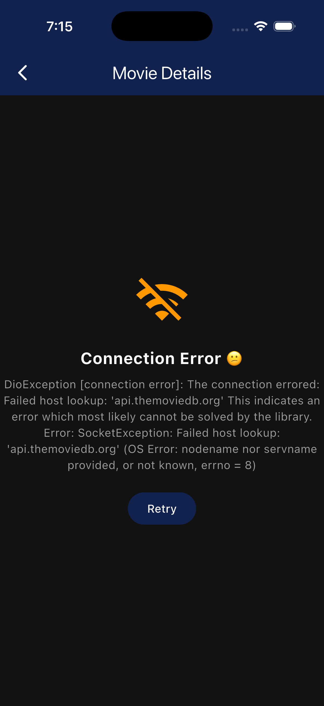
</p>

The screenshots above demonstrate:
- **Left**: Movie details loaded instantly from cache (notice the fast response)
- **Right**: Movie details loaded from API (first time viewing)

### 4. Offline-First Architecture

- **Hive** local database for caching
- First page of movies cached automatically
- Connectivity checking before API calls
- Graceful fallback to cached data
- User alerts for network issues

### 5. Theme System

Three beautiful themes to choose from:

#### Light Theme

- Primary: Orange (#F4813F)
- Secondary: Navy (#11224E)
- Background: White

#### Dark Theme

- Primary: Navy (#11224E)
- Secondary: Orange (#F4813F)
- Background: Dark

#### Custom Pastel Theme

- Primary: Blush Pink (#FFA4A4)
- Secondary: Mint Green (#36CBC4)
- Background: Cream (#FCF9EA)
- Accent: Pale Pink (#FFBDBD)

## Dependencies

### Core Dependencies

```yaml
dependencies:
  flutter:
    sdk: flutter

  # State Management
  flutter_bloc: ^8.1.3          # BLoC pattern
  provider: ^6.1.5+1             # Theme management

  # Networking
  dio: ^5.7.0                    # HTTP client
  retrofit: ^4.1.0               # REST API client
  connectivity_plus: ^7.0.0      # Network status

  # Local Storage
  hive: ^2.2.3                   # NoSQL database
  hive_flutter: ^1.1.0           # Hive Flutter integration
  flutter_secure_storage: ^9.0.0 # Secure storage

  # Dependency Injection
  get_it: ^7.7.0                 # Service locator

  # Routing
  go_router: ^16.3.0             # Declarative routing

  # UI & Utils
  cached_network_image: ^3.4.1   # Image caching
  cupertino_icons: ^1.0.8        # iOS icons

  # Utilities
  dartz: ^0.10.1                 # Functional programming (Either)
  equatable: ^2.0.7              # Value equality
  json_annotation: ^4.9.0        # JSON serialization
  path_provider: ^2.1.5          # File system paths
  pretty_dio_logger: ^1.3.1      # HTTP logging

  # Error Tracking
  sentry_flutter: ^8.10.0        # Error monitoring and crash reporting

dev_dependencies:
  flutter_test:
    sdk: flutter

  # Code Generation
  build_runner: ^2.4.10          # Code generation tool
  hive_generator: ^2.0.1         # Hive code generation
  json_serializable: ^6.8.0      # JSON serialization
  retrofit_generator: ^8.1.0     # Retrofit code generation

  # Linting
  flutter_lints: ^5.0.0          # Flutter lints
```

## API Integration

The app integrates with **The Movie Database (TMDB) API**:

- **Base URL**: `https://api.themoviedb.org/3`
- **Authentication**: Bearer token
- **Endpoints Used**:
  - `GET /movie/popular` - Fetch popular movies with pagination
  - `GET /movie/{movie_id}` - Fetch movie details

### API Configuration

```dart
// lib/core/network/dio_client.dart
- 15-second connection timeout
- 15-second receive timeout
- Bearer token authorization
- Pretty logging in debug mode
```

## Error Handling

Comprehensive error handling with custom exceptions and failures:

### Exceptions

- `ServerException` - API server errors
- `CacheException` - Local storage errors
- `NetworkException` - Connectivity issues

### Failures

- `ServerFailure` - Displayed as user-friendly messages
- `CacheFailure` - Fallback to cache or error UI
- `NetworkFailure` - Network error alerts

### Error UI

- Retry buttons on error screens
- Alert dialogs for network issues
- Placeholder images for missing posters
- Loading states with indicators

### Sentry Integration for Error Tracking

The app integrates **Sentry** for real-time error monitoring and crash reporting:

- **Automatic error capture** - All uncaught exceptions are automatically reported to Sentry
- **Custom error tracking** - Manual error reporting for specific scenarios
- **Performance monitoring** - Track app performance and identify bottlenecks
- **Release tracking** - Monitor errors across different app versions
- **User context** - Additional context to help debug issues

#### Sentry Screenshots

<p align="center">
  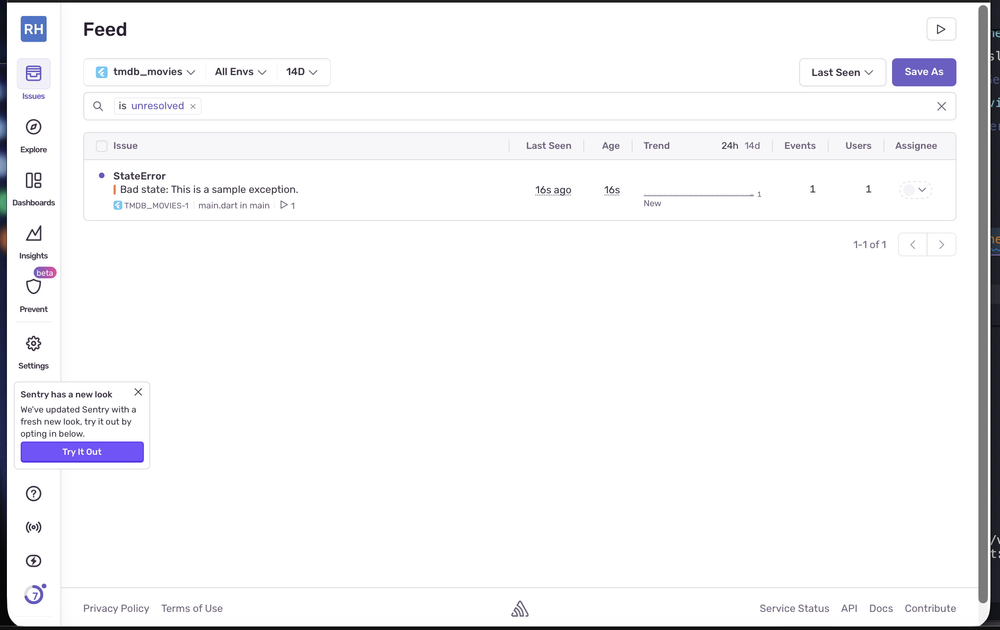
  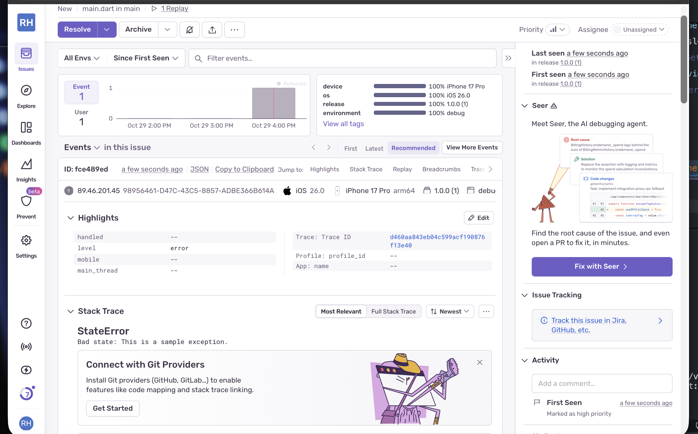
</p>

<p align="center">
  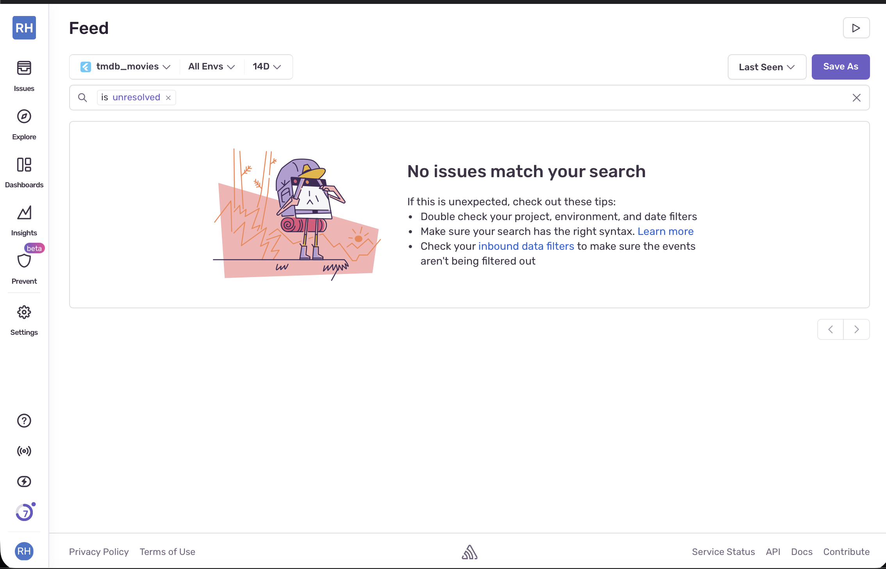
</p>

The screenshots above demonstrate:

1. **Error List View** - Shows all captured exceptions in the Sentry dashboard
2. **Error Details View** - Detailed stack trace and context for debugging
3. **After Fix View** - Monitoring dashboard after resolving the reported errors

## Routing

**GoRouter** implementation with the following routes:

| Route | Page | Description |
|-------|------|-------------|
| `/splash` | SplashPage | Initial animated splash screen |
| `/movies-list` | MoviesPage | Movies listing with pagination |
| `/movies-details/:id` | MovieDetailsPage | Detailed movie information |

## Dependency Injection

**GetIt** service locator pattern:

```dart
// Registered Services:
- Dio (HTTP client)
- MovieApiService (Retrofit API)
- MovieCacheManager (Hive cache for movies list)
- MovieDetailsCacheManager (Hive cache for movie details)
- MovieRepository (Data repository)
- MovieCubit (Factory)
- MovieDetailsCubit (Factory)
- ThemeProvider (Lazy singleton)
```

All services are properly registered in [lib/core/di/service_locator.dart](lib/core/di/service_locator.dart) and injected where needed using GetIt's service locator pattern.

## Getting Started

### Prerequisites

- Flutter SDK (^3.9.2)
- Dart SDK
- TMDB API Key

### Installation

1. Clone the repository:

```bash
git clone https://github.com/Riyam224/TMDB-Movies.git
cd TMDB-Movies
```

2. Install dependencies:

```bash
flutter pub get
```

3. Generate code for Hive, JSON serialization, and Retrofit:

```bash
flutter pub run build_runner build --delete-conflicting-outputs
```

4. Add your TMDB API key:
   - Open [lib/core/constants/api_constants.dart](lib/core/constants/api_constants.dart)
   - Replace `YOUR_API_KEY` with your actual TMDB API key

5. Run the app:

```bash
flutter run
```

## Project Structure Details

### Data Models

- **MovieModel**: Hive-serializable model for caching
  - Fields: id, title, overview, posterPath, voteAverage, genreIds
  - Annotations: `@HiveType`, `@JsonSerializable`

- **MovieDetailsResponse**: Detailed movie information
  - Additional fields: backdropPath, releaseDate, runtime, genres

### Caching Strategy

The app implements a comprehensive two-tier caching system:

#### Movies List Caching
- Page 1 of popular movies cached automatically
- Cache-first approach for offline support
- Cache invalidation on pull-to-refresh
- Hive box: `movies_box`

#### Movie Details Caching (NEW)
- Individual movie details cached after first view
- Persistent cache using Hive database
- Cache-first flow for instant loading
- Hive box: `movie_details_box`
- Each movie stored with its ID as key
- Includes all movie information (poster, backdrop, genres, runtime, etc.)
- Automatic updates when fetching new data from API

**Caching Flow:**
1. User requests movie details
2. Check local cache first (`MovieDetailsCacheManager`)
3. If cached, return instantly (no API call)
4. If not cached, fetch from TMDB API
5. Cache the response for future use
6. Display to user

This approach significantly reduces API calls, improves app performance, and enables full offline functionality for previously viewed content.

### Image Handling

- Base URL: `https://image.tmdb.org/t/p/`
- Poster size: `w500`
- Backdrop size: `original`
- Placeholder service for missing images
- Cached using `CachedNetworkImage`

### Genre Mapping

Hard-coded genre ID to name mapping (19 genres):

- Action, Adventure, Animation, Comedy, Crime
- Documentary, Drama, Family, Fantasy, History
- Horror, Music, Mystery, Romance, Science Fiction
- TV Movie, Thriller, War, Western

#### Genre Names Getter

Both `MovieModel` and `MovieEntity` include a computed `genreNames` getter that converts genre IDs to readable genre names:

```dart
// Usage
List<int> genreIds = [28, 35, 12];  // Action, Comedy, Adventure
List<String> genreNames = movie.genreNames;  // ['Action', 'Comedy', 'Adventure']
```

**Implementation:**
- [lib/features/movies/data/models/movie_model.dart](lib/features/movies/data/models/movie_model.dart#L45-L70)
- [lib/features/movies/domain/entities/movie_entity.dart](lib/features/movies/domain/entities/movie_entity.dart#L18-L43)

**Features:**
- Automatic conversion from genre IDs to genre names
- Returns 'Unknown' for unrecognized genre IDs
- Consistent implementation across data and domain layers
- No additional API calls required

## Logic Implementation

### Pagination Logic

```dart
// MovieCubit handles pagination
1. Load initial page (page 1)
2. User clicks "Load More"
3. Increment currentPage
4. Fetch next page from API
5. Accumulate movies in _allMovies list
6. Emit MovieLoaded with updated list
```

### Theme Switching Logic

```dart
// ThemeProvider with ChangeNotifier
1. User clicks theme button
2. ThemeProvider.changeTheme(themeType)
3. Theme index updated (0=Light, 1=Dark, 2=Custom)
4. notifyListeners() triggers rebuild
5. App theme updates across all screens
```

### Offline Detection Logic

```dart
// NetworkHelper checks connectivity
1. Before API call, check NetworkHelper.hasConnection()
2. If offline: Show alert dialog
3. If online: Proceed with API call
4. On failure: Try loading from cache
5. If cache available: Display cached data
6. If no cache: Show error UI with retry
```

## Testing

The project structure supports testing at multiple levels:

- Unit tests for Cubits and Repositories
- Widget tests for UI components
- Integration tests for complete flows

## Future Enhancements

Potential features to add:

- [ ] Search functionality
- [ ] Movie categories (Top Rated, Upcoming, Now Playing)
- [ ] Favorites/Watchlist
- [ ] User authentication
- [ ] Movie trailers
- [ ] Cast and crew information
- [ ] Reviews and ratings
- [ ] Share movie details
- [ ] Advanced filtering and sorting

## Learning Outcomes

This project demonstrates:

- Clean Architecture implementation in Flutter
- BLoC pattern with Cubit for state management
- API integration with Retrofit and Dio
- Local caching with Hive (two-tier caching system)
- Offline-first app architecture with cache-first strategy
- Individual item caching (movie details) for optimal performance
- Dependency injection with GetIt
- Declarative routing with GoRouter
- Custom theming system
- Error handling patterns
- Image optimization and caching
- Network connectivity handling
- Hive type adapters and code generation

### New Implementation (Week 7): Movie Details Caching

This week added a sophisticated movie details caching system:

- **MovieDetailsCacheManager**: Dedicated cache manager for individual movie details
- **Enhanced Model Serialization**: Added Hive annotations to MovieDetailsResponse and GenreModel
- **Cache-First Flow**: Repository checks cache before API calls
- **Performance Optimization**: Instant loading for previously viewed movies
- **Reduced API Usage**: Minimizes network calls and bandwidth consumption
- **Full Offline Support**: Complete movie details available offline after first view

### Recent Updates: Code Fixes and Improvements

#### 1. Genre Names Getter Implementation

Added a `genreNames` getter to `MovieModel` for convenient genre ID to name conversion:

- **Location**: [lib/features/movies/data/models/movie_model.dart:45-70](lib/features/movies/data/models/movie_model.dart#L45-L70)
- **Feature**: Automatically converts genre IDs (e.g., `[28, 35]`) to readable names (e.g., `['Action', 'Comedy']`)
- **Benefit**: Eliminates need for manual genre mapping in UI layer
- **Consistency**: Matches implementation in `MovieEntity` for consistent behavior across layers

#### 2. Connectivity API Update

Fixed compatibility with the latest `connectivity_plus` package:

- **File**: [lib/core/utils/network_helper.dart:6](lib/core/utils/network_helper.dart#L6)
- **Change**: Updated from `result != ConnectivityResult.none` to `!result.contains(ConnectivityResult.none)`
- **Reason**: The newer version of `connectivity_plus` returns `List<ConnectivityResult>` instead of a single value
- **Impact**: Resolves type mismatch error and ensures proper network detection

#### 3. Material 3 Deprecation Fixes

Updated deprecated Material Design 3 color scheme properties in Splash Page:

- **File**: [lib/features/movies/presentation/pages/splash_page.dart](lib/features/movies/presentation/pages/splash_page.dart)
- **Changes**:
  - `colorScheme.background` → `colorScheme.surface` (line 66)
  - `colorScheme.onBackground` → `colorScheme.onSurface` (lines 75, 82, 89)
  - `withOpacity(0.7)` → `withValues(alpha: 0.7)` (line 89)
- **Benefit**: Ensures compatibility with Flutter 3.9+ and Material Design 3 specifications
- **Impact**: Removes all deprecation warnings related to color scheme

#### 4. Code Generation

Successfully ran `build_runner` to regenerate all necessary files:

- Generated 828 outputs from Hive, JSON, and Retrofit annotations
- All model serialization code updated
- API service code regenerated with latest configurations

## Contributing

This is a learning project for Flutter Mentorship Week 6. Feel free to fork and experiment!

## License

This project is for educational purposes.

## Acknowledgments

- [The Movie Database (TMDB)](https://www.themoviedb.org/) for providing the API
- Flutter community for excellent packages and documentation
- Flutter Mentorship program

---

**Built with Flutter** 💙
