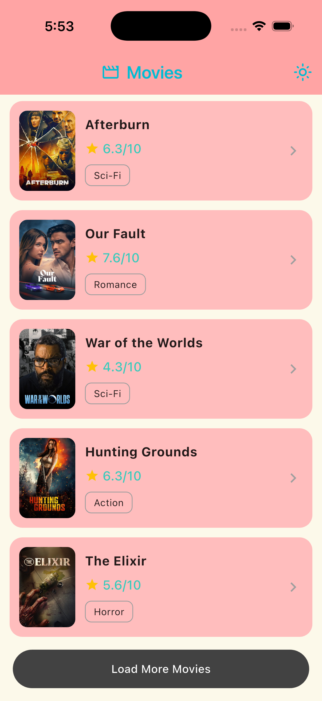
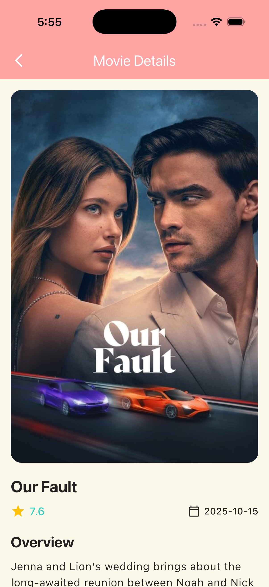

# Movies App

A feature-rich Flutter application that showcases popular movies using The Movie Database (TMDB) API. This app demonstrates clean architecture principles, modern state management, offline-first approach, and professional UI/UX design.

## Features

- Browse popular movies with pagination
- View detailed movie information
- Offline-first architecture with caching
- Multiple theme support (Light, Dark, Custom Pastel)
- Network connectivity detection
- Smooth animations and transitions
- Image caching for optimal performance
- Clean Architecture with proper separation of concerns

## Screenshots

### Splash Screen

<p align="center">
  
  
  
</p>

### Movies List

<p align="center">
  
  
  
</p>

### Movie Details

<p align="center">
  
  
  
</p>

## Demo

### With WiFi Connection


### Without WiFi Connection (Offline Mode)


## Architecture

The app follows **Clean Architecture** principles with three main layers:

```
lib/
├── core/                          # Core utilities and configurations
│   ├── constants/                 # API constants
│   ├── di/                        # Dependency injection (GetIt)
│   ├── error/                     # Error handling & failures
│   ├── network/                   # Dio client configuration
│   ├── routing/                   # GoRouter configuration
│   ├── storage/                   # Secure storage
│   ├── theme/                     # Theme management
│   └── utils/                     # Network helper utilities
│
├── features/movies/               # Movies feature module
│   ├── data/
│   │   ├── datasources/           # API service & cache manager
│   │   ├── models/                # Data models (Hive + JSON)
│   │   └── repositories/          # Repository implementation
│   ├── domain/
│   │   ├── entities/              # Business entities
│   │   └── repositories/          # Repository interface
│   └── presentation/
│       ├── cubit/                 # State management (BLoC)
│       └── pages/                 # UI pages
│
└── main.dart                      # App entry point
```

### Data Flow

```
Presentation Layer (UI)
    ↓
Cubit (State Management)
    ↓
Repository Interface
    ↓
Repository Implementation
    ├─→ Local Cache (Hive)
    └─→ Remote API (Retrofit + Dio)
```

## State Management

The app uses **BLoC pattern with Cubit** for state management:

- **MovieCubit**: Manages movies list, pagination, and caching
- **MovieDetailsCubit**: Handles individual movie details
- **ThemeProvider**: Manages theme switching using Provider

### State Classes

- `MovieInitial` - Initial state
- `MovieLoading` - Loading indicator
- `MovieLoaded` - Data successfully loaded
- `MovieError` - Error state with message

## Key Features Implementation

### 1. Splash Screen

- Animated fade-in effect
- Auto-navigation after 20 seconds
- Theme switcher
- Skip functionality

### 2. Movies List Page

- Grid display of popular movies
- Movie poster with caching
- Star rating display
- Genre badges
- Pagination with "Load More" button
- Offline detection with alerts
- Pull-to-refresh functionality

### 3. Movie Details Page

- Hero animation for poster images
- Comprehensive movie information:
  - High-resolution poster
  - Title and rating
  - Release date
  - Runtime (minutes)
  - Full overview/plot
  - Genre list
  - Backdrop image
- Error handling with retry button
- Offline support

### 4. Offline-First Architecture

- **Hive** local database for caching
- First page of movies cached automatically
- Connectivity checking before API calls
- Graceful fallback to cached data
- User alerts for network issues

### 5. Theme System

Three beautiful themes to choose from:

#### Light Theme

- Primary: Orange (#F4813F)
- Secondary: Navy (#11224E)
- Background: White

#### Dark Theme

- Primary: Navy (#11224E)
- Secondary: Orange (#F4813F)
- Background: Dark

#### Custom Pastel Theme

- Primary: Blush Pink (#FFA4A4)
- Secondary: Mint Green (#36CBC4)
- Background: Cream (#FCF9EA)
- Accent: Pale Pink (#FFBDBD)

## Dependencies

### Core Dependencies

```yaml
dependencies:
  flutter:
    sdk: flutter

  # State Management
  flutter_bloc: ^8.1.3          # BLoC pattern
  provider: ^6.1.5+1             # Theme management

  # Networking
  dio: ^5.7.0                    # HTTP client
  retrofit: ^4.1.0               # REST API client
  connectivity_plus: ^7.0.0      # Network status

  # Local Storage
  hive: ^2.2.3                   # NoSQL database
  hive_flutter: ^1.1.0           # Hive Flutter integration
  flutter_secure_storage: ^9.0.0 # Secure storage

  # Dependency Injection
  get_it: ^7.7.0                 # Service locator

  # Routing
  go_router: ^16.3.0             # Declarative routing

  # UI & Utils
  cached_network_image: ^3.4.1   # Image caching
  cupertino_icons: ^1.0.8        # iOS icons

  # Utilities
  dartz: ^0.10.1                 # Functional programming (Either)
  equatable: ^2.0.7              # Value equality
  json_annotation: ^4.9.0        # JSON serialization
  path_provider: ^2.1.5          # File system paths
  pretty_dio_logger: ^1.3.1      # HTTP logging

  # Error Tracking
  sentry_flutter: ^8.10.0        # Error monitoring and crash reporting

dev_dependencies:
  flutter_test:
    sdk: flutter

  # Code Generation
  build_runner: ^2.4.10          # Code generation tool
  hive_generator: ^2.0.1         # Hive code generation
  json_serializable: ^6.8.0      # JSON serialization
  retrofit_generator: ^8.1.0     # Retrofit code generation

  # Linting
  flutter_lints: ^5.0.0          # Flutter lints
```

## API Integration

The app integrates with **The Movie Database (TMDB) API**:

- **Base URL**: `https://api.themoviedb.org/3`
- **Authentication**: Bearer token
- **Endpoints Used**:
  - `GET /movie/popular` - Fetch popular movies with pagination
  - `GET /movie/{movie_id}` - Fetch movie details

### API Configuration

```dart
// lib/core/network/dio_client.dart
- 15-second connection timeout
- 15-second receive timeout
- Bearer token authorization
- Pretty logging in debug mode
```

## Error Handling

Comprehensive error handling with custom exceptions and failures:

### Exceptions

- `ServerException` - API server errors
- `CacheException` - Local storage errors
- `NetworkException` - Connectivity issues

### Failures

- `ServerFailure` - Displayed as user-friendly messages
- `CacheFailure` - Fallback to cache or error UI
- `NetworkFailure` - Network error alerts

### Error UI

- Retry buttons on error screens
- Alert dialogs for network issues
- Placeholder images for missing posters
- Loading states with indicators

### Sentry Integration for Error Tracking

The app integrates **Sentry** for real-time error monitoring and crash reporting:

- **Automatic error capture** - All uncaught exceptions are automatically reported to Sentry
- **Custom error tracking** - Manual error reporting for specific scenarios
- **Performance monitoring** - Track app performance and identify bottlenecks
- **Release tracking** - Monitor errors across different app versions
- **User context** - Additional context to help debug issues

#### Sentry Screenshots

<p align="center">
  
  
</p>

<p align="center">
  
</p>

The screenshots above demonstrate:

1. **Error List View** - Shows all captured exceptions in the Sentry dashboard
2. **Error Details View** - Detailed stack trace and context for debugging
3. **After Fix View** - Monitoring dashboard after resolving the reported errors

## Routing

**GoRouter** implementation with the following routes:

| Route | Page | Description |
|-------|------|-------------|
| `/splash` | SplashPage | Initial animated splash screen |
| `/movies-list` | MoviesPage | Movies listing with pagination |
| `/movies-details/:id` | MovieDetailsPage | Detailed movie information |

## Dependency Injection

**GetIt** service locator pattern:

```dart
// Registered Services:
- Dio (HTTP client)
- MovieApiService (Retrofit API)
- MovieCacheManager (Hive cache)
- MovieRepository (Data repository)
- MovieCubit (Factory)
- MovieDetailsCubit (Factory)
- ThemeProvider (Lazy singleton)
```

## Getting Started

### Prerequisites

- Flutter SDK (^3.9.2)
- Dart SDK
- TMDB API Key

### Installation

1. Clone the repository:

```bash
git clone <repository-url>
cd movies_app
```

2. Install dependencies:

```bash
flutter pub get
```

3. Generate code for Hive, JSON serialization, and Retrofit:

```bash
flutter pub run build_runner build --delete-conflicting-outputs
```

4. Add your TMDB API key:
   - Open [lib/core/constants/api_constants.dart](lib/core/constants/api_constants.dart)
   - Replace `YOUR_API_KEY` with your actual TMDB API key

5. Run the app:

```bash
flutter run
```

## Project Structure Details

### Data Models

- **MovieModel**: Hive-serializable model for caching
  - Fields: id, title, overview, posterPath, voteAverage, genreIds
  - Annotations: `@HiveType`, `@JsonSerializable`

- **MovieDetailsResponse**: Detailed movie information
  - Additional fields: backdropPath, releaseDate, runtime, genres

### Caching Strategy

- Page 1 of popular movies cached automatically
- Cache-first approach for offline support
- Cache invalidation on pull-to-refresh
- Hive box named: `movies_box`

### Image Handling

- Base URL: `https://image.tmdb.org/t/p/`
- Poster size: `w500`
- Backdrop size: `original`
- Placeholder service for missing images
- Cached using `CachedNetworkImage`

### Genre Mapping

Hard-coded genre ID to name mapping (19 genres):

- Action, Adventure, Animation, Comedy, Crime
- Documentary, Drama, Family, Fantasy, History
- Horror, Music, Mystery, Romance, Science Fiction
- TV Movie, Thriller, War, Western

## Logic Implementation

### Pagination Logic

```dart
// MovieCubit handles pagination
1. Load initial page (page 1)
2. User clicks "Load More"
3. Increment currentPage
4. Fetch next page from API
5. Accumulate movies in _allMovies list
6. Emit MovieLoaded with updated list
```

### Theme Switching Logic

```dart
// ThemeProvider with ChangeNotifier
1. User clicks theme button
2. ThemeProvider.changeTheme(themeType)
3. Theme index updated (0=Light, 1=Dark, 2=Custom)
4. notifyListeners() triggers rebuild
5. App theme updates across all screens
```

### Offline Detection Logic

```dart
// NetworkHelper checks connectivity
1. Before API call, check NetworkHelper.hasConnection()
2. If offline: Show alert dialog
3. If online: Proceed with API call
4. On failure: Try loading from cache
5. If cache available: Display cached data
6. If no cache: Show error UI with retry
```

## Testing

The project structure supports testing at multiple levels:

- Unit tests for Cubits and Repositories
- Widget tests for UI components
- Integration tests for complete flows

## Future Enhancements

Potential features to add:

- [ ] Search functionality
- [ ] Movie categories (Top Rated, Upcoming, Now Playing)
- [ ] Favorites/Watchlist
- [ ] User authentication
- [ ] Movie trailers
- [ ] Cast and crew information
- [ ] Reviews and ratings
- [ ] Share movie details
- [ ] Advanced filtering and sorting

## Learning Outcomes

This project demonstrates:

- Clean Architecture implementation in Flutter
- BLoC pattern with Cubit for state management
- API integration with Retrofit and Dio
- Local caching with Hive
- Offline-first app architecture
- Dependency injection with GetIt
- Declarative routing with GoRouter
- Custom theming system
- Error handling patterns
- Image optimization and caching
- Network connectivity handling

## Contributing

This is a learning project for Flutter Mentorship Week 6. Feel free to fork and experiment!

## License

This project is for educational purposes.

## Acknowledgments

- [The Movie Database (TMDB)](https://www.themoviedb.org/) for providing the API
- Flutter community for excellent packages and documentation
- Flutter Mentorship program

---

**Built with Flutter** 💙
